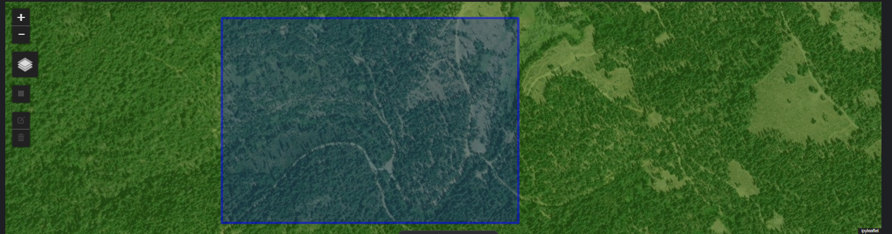

## Example

In this example, we will find public lidar data on an online server, download data, clean it, canopy height statistics, and write files locally.

## Find point cloud data
First we need to get some data to work with. I will show one method to pull data from an online server. First, we must define an area of interest using a bounding box `[xmin, ymin, xmax, ymax]`. 

In the first cell, I demonstrate how you can extract a bounding box from an interactive map using ipyleaflet (`conda install ipyleaflet`). Alternatively, you can skip this step and input a bounding box manually.


```python
import ipyleaflet
import numpy as np

basemap = ipyleaflet.TileLayer(url='https://services.arcgisonline.com/arcgis/rest/services/World_Imagery/MapServer/tile/{z}/{y}/{x}')
m = ipyleaflet.Map(center=[39, -100], zoom=5, scroll_wheel_zoom=True, basemap=basemap)
m.add(ipyleaflet.WMSLayer(url='https://index.nationalmap.gov:443/arcgis/services/3DEPElevationIndex/MapServer/WmsServer?',
                          layers='23',opacity=.5,name='USGS 3DEP overlay'))
m.add(ipyleaflet.LayersControl())
bbox = None
def handle_draw(target, action, geo_json):
    global bbox
    coords = geo_json['geometry']['coordinates'][0]
    bbox = [coords[0][0], coords[0][1], coords[2][0], coords[2][1]]
draw_control = ipyleaflet.DrawControl(rectangle={'shapeOptions': {'color': '#0000FF'}},
    polyline={}, polygon={}, circle={}, circlemarker={}, marker={}
)
draw_control.on_draw(handle_draw)
m.add_control(draw_control)
m
```



```python
# Print bounding box selected in interactive map
bbox

# If you want manually input a bounding box, uncomment the line below and edit the values
#bbox = [-111.676326, 35.316211, -111.671391, 35.320098]
```

Next, we can search the USGS 3DEP catalog to find publicly available point clouds that overlap our area of interest using `pdal_piper.USGS_3dep_Finder`. USGS 3DEP is stored in Entwine Point Tile (.ept) format which means we can efficiently download small segments of the point cloud using a url.


```python
import pdal_piper
finder = pdal_piper.USGS_3dep_Finder()
finder.search_3dep(bbox,'EPSG:4326')
finder.search_result
```
<div>
<style scoped>
    .dataframe tbody tr th:only-of-type {
        vertical-align: middle;
    }

    .dataframe tbody tr th {
        vertical-align: top;
    }

    .dataframe thead th {
        text-align: right;
    }
</style>
<table border="1" class="dataframe">
  <thead>
    <tr style="text-align: right;">
      <th></th>
      <th>name</th>
      <th>id</th>
      <th>pct_coverage</th>
      <th>pts_per_m2</th>
      <th>count</th>
      <th>total_area_ha</th>
      <th>url</th>
      <th>geometry</th>
    </tr>
  </thead>
  <tbody>
    <tr>
      <th>120</th>
      <td>AZ_Coconino_B1_2019</td>
      <td>120</td>
      <td>100.0</td>
      <td>15.372670</td>
      <td>55223690056</td>
      <td>359232.920560</td>
      <td>https://s3-us-west-2.amazonaws.com/usgs-lidar-...</td>
      <td>POLYGON ((-111.67633 35.3201, -111.67139 35.32...</td>
    </tr>
    <tr>
      <th>1253</th>
      <td>USGS_LPC_AZ_VerdeKaibab_B2_2018_LAS_2019</td>
      <td>1253</td>
      <td>100.0</td>
      <td>5.324541</td>
      <td>35728383864</td>
      <td>671013.439139</td>
      <td>https://s3-us-west-2.amazonaws.com/usgs-lidar-...</td>
      <td>POLYGON ((-111.67633 35.3201, -111.67139 35.32...</td>
    </tr>
  </tbody>
</table>
</div>

```python
# Here we select the URL for the dataset in the first row. 
# Alternatively, we could use a loop and download all of the available datasets.
url = finder.select_url(0)
url
```


    'https://s3-us-west-2.amazonaws.com/usgs-lidar-public/AZ_Coconino_B1_2019/ept.json'


## Define tile set
To improve computational efficiency and scalability, we can divide our area of interest into a set of tiles using a Tiler object. We specify the total extent of the tileset and the size of each tile. Notice, our extents are defined by geographic coordinates (degrees lat/lon) but we defined the tile size in meters, therefore, we set `convert_units=True`. `get_tiles()` gives us some options to format the tiles. We select the first tile from the upper left corner as a test.


```python
tiler = pdal_piper.Tiler(extents = bbox, tile_size=100, buffer=0, convert_units=True, crs='EPSG:4326')
tile_bounds = tiler.get_tiles(format_as_pdal_str=True,flatten=False)
print(type(tile_bounds))
print(tile_bounds.shape)
```

    <class 'numpy.ndarray'>
    (4, 4)
    


```python
first_tile_bounds = tile_bounds[0,0]
first_tile_bounds
```


    '([-111.676326, -111.67522509346652], [35.3191979991, 35.320098], [-9999, 9999])/EPSG:4326'


## Define processing pipeline
We need to create a processing pipeline that defines all actions we want PDAL to execute. Each action in the pipeline is described by a 'stage'. In other workflows, the stages are combined in a json-like object, stored as a text file, and run through PDAL via the command line interface. In contrast, `pdal_piper` makes the experience more Pythonic by providing a Python class with built-in documentation for each stage. We use these classes to define each stage, then combine the stages in a list, then pass the list into a Piper object. The Piper object will format the json text and pass it to PDAL for execution.


```python
import pdal
import numpy as np

# Define processing pipeline for the first tile
pipelines = []

for xi, yi in np.ndindex(tile_bounds.shape):
    stages = [
        pdal.Reader.ept(filename=url, bounds=tile_bounds[xi, yi]),
        pdal.Filter.outlier(method='statistical',mean_k=12,multiplier=2.2),
        pdal.Filter.range(limits='Classification[0:6]'),
        pdal.Filter.hag_delaunay(),
        pdal.Writer.copc(filename=f'test_data/points_{xi}_{yi}.laz', extra_dims='all'),
        pdal.Writer.gdal(filename='test_data/canopy_metrics.tif', resolution=1,
                         dimension='HeightAboveGround', output_type='all', binmode=True)
    ]
    pipelines.append(pdal.Pipeline(stages))

# View pipeline for first tile in json formatting
pipelines[0].toJSON()
```


    '[{"type": "readers.ept", "bounds": "([-111.676326, -111.67522509346652], [35.3191979991, 35.320098], [-9999, 9999])/EPSG:4326", "filename": "https://s3-us-west-2.amazonaws.com/usgs-lidar-public/AZ_Coconino_B1_2019/ept.json", "tag": "readers_ept1"}, {"type": "filters.outlier", "method": "statistical", "mean_k": 12, "multiplier": 2.2, "tag": "filters_outlier1"}, {"type": "filters.range", "limits": "Classification[0:6]", "tag": "filters_range1"}, {"type": "filters.hag_delaunay", "tag": "filters_hag_delaunay1"}, {"type": "writers.copc", "extra_dims": "all", "filename": "test_data/points_0_0.laz", "tag": "writers_copc1"}, {"type": "writers.gdal", "resolution": 1, "dimension": "HeightAboveGround", "output_type": "all", "binmode": true, "filename": "test_data/canopy_metrics.tif", "tag": "writers_gdal1"}]'


```python
# Execute pipeline for first tile as a test
pipelines[0].execute()
pipelines[0].log
# If the log is empty, that is good. Otherwise, errors will show up in the log.
```


    ''


Lastly, we can run the pipeline on all files in the tile set. Tile bounds in the reader stage will automatically be assigned from the unique tile bounds. File names in the writer stages will automatically be assigned a unique value by inserting tile indices between the file basename and the file extension. Pipelines are executed in parallel processes.

Note, if `Tiler.buffer>0` and the `filters_crop` stage is used in the pipeline, the filter will automatically use the buffered tile extents in the reader and the unbuffered tile extents in the crop filter. In this special case, the CRS of the Tiler must match the CRS of the point cloud.


```python
# Execute pipeline for all tiles
logs = pdal_piper.execute_pipelines_parallel(pipelines)
[log for log in logs if log != '']
```


    []


From here, additional analysis can be carried out with your software of choice.
